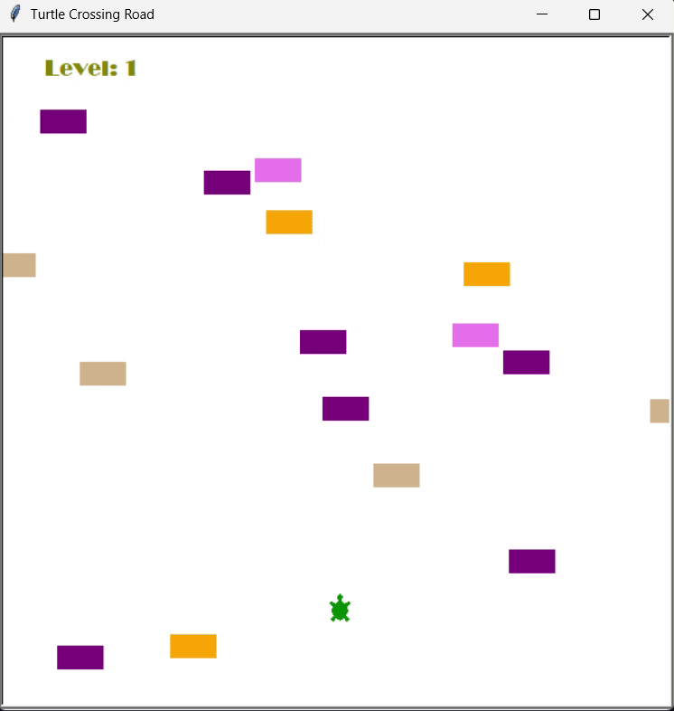

# 🐢 Turtle Crossing Game (Python Turtle)

A fun arcade-style game inspired by the classic **Frogger**, built using Python's built-in `turtle` module. Help the turtle cross the road, avoid incoming cars, and reach the finish line. With each successful crossing, the difficulty increases!

---

## 📷 Demo

---

## 🎮 Gameplay Overview

You control a turtle trying to cross a busy road. Cars continuously appear from the right side of the screen and move leftwards. Your goal is to avoid getting hit by cars while navigating upward toward the top of the screen.

Each successful crossing increases your level and speeds up the cars, making the game progressively harder.

---

## 🚀 Features

- Smooth player control using the `Up` arrow key
- Randomized car generation and positions for dynamic difficulty
- Level system with increasing car speed after each successful crossing
- Collision detection:
  - Player-car collision ends the game
  - Reaching the top of the screen triggers level-up
- Scoreboard that displays the current level
- Clean and modular Object-Oriented Programming (OOP) structure

---

## 🧱 Code Structure

### `main.py`
The game's entry point. It initializes the game screen, creates key game components, and runs the main game loop.

**Responsibilities:**
- Set up the screen
- Listen for key presses (`Up` arrow)
- Call methods to:
  - Create and move cars
  - Detect collisions
  - Track and update level

---

### `player.py`
Handles everything related to the player-controlled turtle.

**Key Functions:**
- Move up when the `Up` key is pressed
- Reset to the starting position upon crossing
- Check if the turtle has reached the finish line

---

### `car_manager.py`
Manages all aspects of car behavior.

**Key Features:**
- Random car generation with different colors and lanes
- Movement of cars from right to left
- Incremental speed-up with each level
- Stores all car instances in a list for easy access and updates

---

### `scoreboard.py`
Displays the player's current level and shows a "Game Over" message when the game ends.

**Details:**
- Shows the level at the top-left corner
- Increases the level after each successful crossing
- Displays `"GAME OVER"` at the center of the screen upon collision

---

## 🕹 Controls

| Key | Action        |
|-----|---------------|
| Up  | Move forward  |

> 🚫 The turtle only moves forward. Use timing and reflexes to avoid getting hit by cars!

---

## 💻 Requirements

- Python 3.x
- No external libraries required  
  *(Uses built-in `turtle`, `random`, and `time` modules)*

---

## 🧠 How Difficulty Works

At every level-up (i.e., when the turtle reaches the top), the speed of all upcoming cars increases slightly.

This creates a gradually more challenging experience without making the game unfair or too fast too soon.
